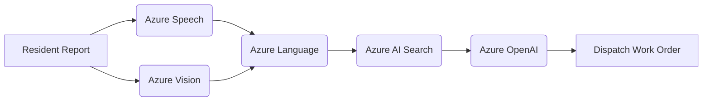

# CivicPulse — Azure AI Hazard Triage

**CivicPulse** is an intelligent, multi-modal civic hazard triage platform developed for **Season of AI 2.0**. It transforms resident voice notes and incident photos into ranked, policy-backed municipal dispatch plans in seconds by chaining 5 Azure AI services into a single unified operator.

---

## 🌟 Overview

When infrastructure issues occur — such as broken water mains, unlit roads, or storm flooding — residents need a fast and accessible way to report them. **CivicPulse** listens, visually inspects evidence, rates the severity, references city bylaws, and drafts ready-to-dispatch work orders automatically.

---

## ⚡ Architecture & Azure AI Pipeline

CivicPulse chains 5 core Azure AI services into one sequential triage workflow:



1. **Azure AI Speech**: Transcribes resident voice notes accurately across regional accents.
2. **Azure AI Vision**: Analyzes uploaded hazard photos, detecting structural damage, obstruction, and safety risks.
3. **Azure AI Language**: Scores report urgency, extracts key location/hazard entities, and evaluates sentiment.
4. **Azure AI Search**: Vector & hybrid search querying official municipal bylaws and response protocols.
5. **Azure OpenAI (GPT-4)**: Synthesizes multi-modal data to draft a detailed dispatch plan for field teams.

---

## 🛠️ Built With

- **Framework**: [TanStack Start](https://tanstack.com/start) / [React 19](https://react.dev/) / [TypeScript](https://www.typescriptlang.org/)
- **Build Tool**: [Vite](https://vitejs.dev/)
- **Styling**: [Tailwind CSS v4](https://tailwindcss.com/)
- **UI Components**: [Radix UI](https://www.radix-ui.com/), [Lucide Icons](https://lucide.dev/), [Recharts](https://recharts.org/)
- **3D & Motion**: Three.js / React Three Fiber interactive hero stage

---

## 🚀 Getting Started

### Prerequisites

Ensure you have **Node.js** (v18 or higher) and **npm** installed.

### Installation

1. **Clone the repository**:
   ```bash
   git clone https://github.com/mahekaggarwal17/Final-Project.git
   cd Final-Project
   ```

2. **Install dependencies**:
   ```bash
   npm install
   ```

3. **Start the development server**:
   ```bash
   npm run dev
   ```

   Open [http://localhost:8080](http://localhost:8080) in your browser to view the app.

---

## 📜 Available Scripts

- `npm run dev` — Starts the Vite development server.
- `npm run build` — Builds the application for production.
- `npm run preview` — Previews the production build locally.
- `npm run lint` — Runs ESLint checks.
- `npm run format` — Formats code using Prettier.

---

## 📄 License

This project is open-source under the MIT License.
